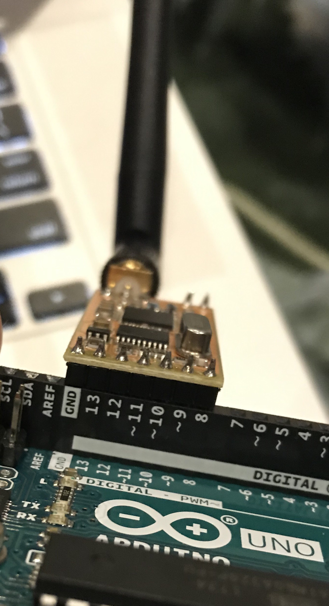
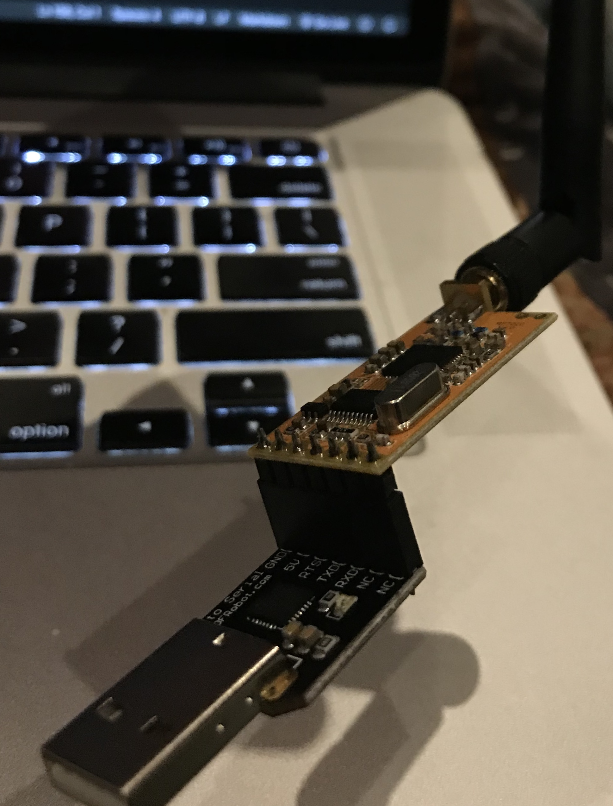
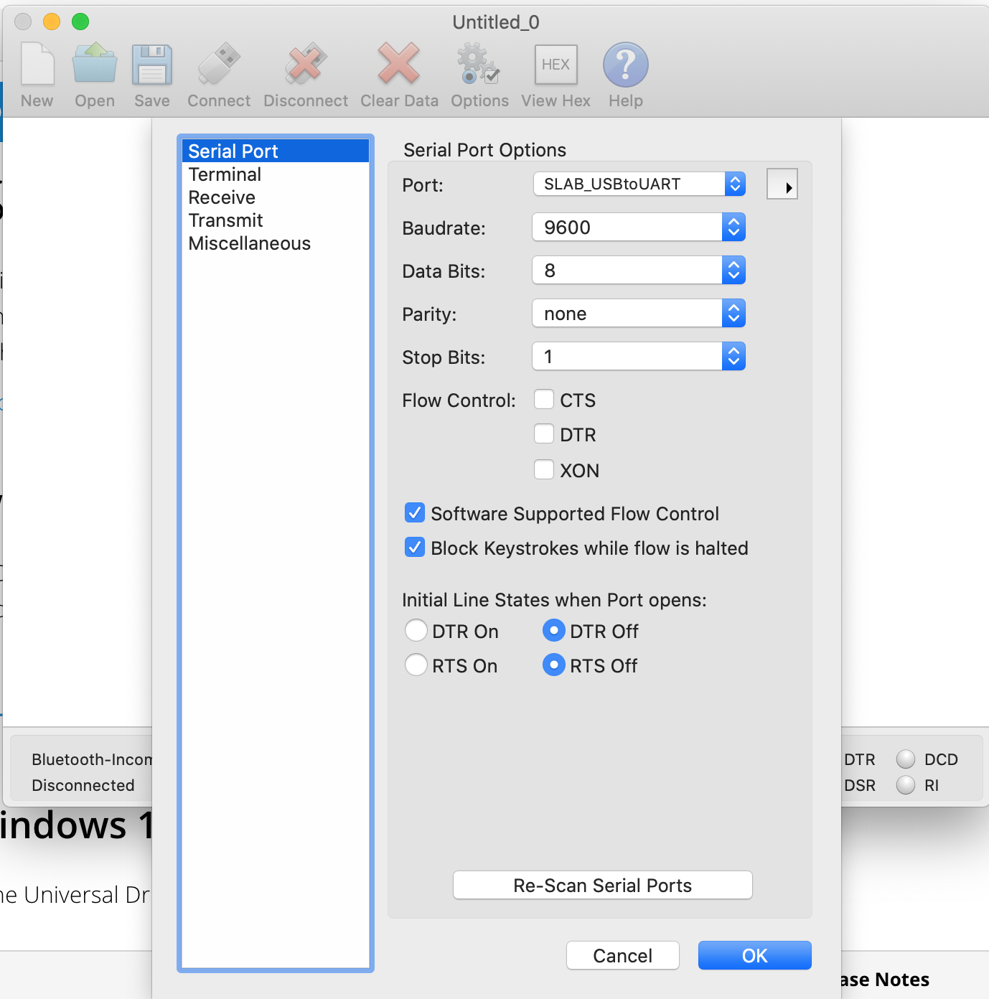

# Broadcast from your Arduino to your Computer

## Getting Started
### What You Should Know Before You Start
This tutorial assumes you have the following basic knowledge of Arduino programming:
* How to select the correct Arduino Board
* How to select the correct Port
* How to compile and upload new programs to your Arduino
* How to use the Serial Monitor

### Hardware
For this project, you will need:
1. A pair of [APC220 radios](https://www.dfrobot.com/product-57.html?search=apc220&description=true)
2. A [USB-TTL adapter](https://www.dfrobot.com/product-104.html)

### Download and Install Software
You've already installed the Arduino IDE, but you will need some additional software for this project.

#### Drivers for your USB-TTL Adapter
This adapter allows us to connect one of the APC220 radios to our PC.

If you are using the DFRobot adapter linked above, [this driver from SILabs](https://www.silabs.com/products/development-tools/software/usb-to-uart-bridge-vcp-drivers) will likely work as it is based on the CP210x chipset. Otherwise, you'll have to find the correct driver for your hardware. 

#### Software that can read a Serial Terminal
This allows us to read the data coming from the radio plugged into the USB-TTL adapter. There are a *lot* of choices for this, so really you can find anything that will work. 

That said, [CoolTerm](https://freeware.the-meiers.org/) is a simple program that works on Windows/Mac/Linux and is geared specifically at serial communications. The interface varies slightly between the different platforms, but you'll make sense of the differences easily enough.

## Arduino Program, Part 1: Basic Output
This program will look very simple, and initially has nothing to do with the radio. It just makes sure that you have a basic program up and running, where you can see the output on the serial monitor.

```c class:"lineNo"
void setup() {
  // enable serial commms
  Serial.begin(9600);
}

void loop() {
  // Send something for the world to see
  Serial.println('Hello, world!');
  delay(1000);
}
```

Upload this to your Arduino and you'll see this printing `Hello, world!` every second on the Serial Monitor.

## Arduino Program, Part 2: Setting up the Radio Before `setup()` Function Definition
We will want to be able to communicate with the radio in a simple way; for that Arduino gives us the `SoftwareSerial` library which we can `#include`:

```c class:"lineNo"
#include <SoftwareSerial.h>
```

Look at the APC220 spec sheet and you will see a table that tells us what each pin does (and where the pin is on the board):

|Pin|Technical Code|Function|
|---|--------------|--------|
|1  |GND           | 0V Ground|
|2  |VCC           | 3.3V-5.5V Power|
|3  |EN            | Enable the device when leave it disconnected or apply >1.6V Disable the device when apply <0.5V|
|4  |RXD           | UART RX|
|5  |TXD           | UART TX|
|6  |AUX           | UART Signal- Receive (low) Transmit (high)|
|7  |SET           | Set parameters (low)|

We won't get into every function in this tutorial, but to start with we will `#define` the pins in the way we plan to connect it:

```c class:"lineNo"
// These are the radio function pins (except for GND) 
// https://wiki.dfrobot.com/APC220_Radio_Data_Module_SKU_TEL0005_
// with defined pin number being the one each is connected to the Arduino
#define RADIO_PIN_2_VCC 13
#define RADIO_PIN_3_EN  12
#define RADIO_PIN_4_RXD 11
#define RADIO_PIN_5_TXD 10
#define RADIO_PIN_6_AUX 9
#define RADIO_PIN_7_SET 8
```

And finally in this section we will define a variable named `apc220` of type `SoftwareSerial`, which we can use to communicate with the radio

```c class:"lineNo"
// The SoftwareSerial doc https://www.arduino.cc/en/Reference/SoftwareSerialConstructor
// documents constructor SoftwareSerial(rxPin, txPin) 
//     rxPin: the pin on which to receive serial data
//     txPin: the pin on which to transmit serial data
// To send from the Arduino to the Radio, we need to "transmit serial data"
//   but we need to transmit this data to the Radio's RX (Receive) pin. So
//   this looks a little backwards at first, but it's the way to do this :)
// This call gives us a variable called "apc220" we can use to communcate with the radio
SoftwareSerial apc220(RADIO_PIN_5_TXD, RADIO_PIN_4_RXD);
```

## Arduino Program, Part 3: Updating the `setup()` Function Definition

Just like we call `begin()` on `Serial` to communicate with the serial port, we will do the same with our `apc220` variable, as it is an instance of `SoftwareSerial`:
```c class:"lineNo"
  // enable serial commms
  Serial.begin(9600);
  apc220.begin(9600);
```

Next we will explicitly map the pins we want to manage. The `TXD` and `RXD` pins are taken care of by `SoftwareSerial`, and the `GND` pin is, by definition, wired to ground so we won't be changing that :)

```c class:"lineNo"
  // Setup non-TX/RX radio pins as OUTPUTs
  pinMode(RADIO_PIN_2_VCC, OUTPUT);
  pinMode(RADIO_PIN_3_EN, OUTPUT);
  pinMode(RADIO_PIN_6_AUX, OUTPUT);
  pinMode(RADIO_PIN_7_SET, OUTPUT);
```

These next calls will set these pins into the mode we will use for our program:

```c class:"lineNo"
  // ensure we are out of configuration mode
  digitalWrite(RADIO_PIN_7_SET,HIGH);

  // enable the radio; we can disable if we want to go into a lower-power mode
  digitalWrite(RADIO_PIN_3_EN,HIGH);

  // power up the radio
  digitalWrite(RADIO_PIN_2_VCC,HIGH);

  // set the radio in transmit mode as this is a "broadcast" program
  digitalWrite(RADIO_PIN_6_AUX,HIGH);
```

And at this point, our `setup()` is complete.

## Arduino Program, Part 4: Updating the `loop()` Function Definition
If you're following along well and saw how we set up `apc220` in the same way as `Serial` in the `setup()` function, it will not surprise you that in order to write the same thing to the radio as `Serial` will be:

```c class:"lineNo"
  apc220.println('Hello, world!');
```

## Arduino Program, Completed
You can see the completed program (and open it in Arduino IDE) [apc220-broadcast.ino](./apc220-broadcast/apc220-broadcast.ino).

So, next step is to compile and upload to the Arduino. When running, you should see the same `Hello, world!` on the Serial Monitor. Of course, nothing else will be different because we've not connected the radio to anything!  So that's what we'll do next.

## Connecting the Radio to the Arduino

When doing any changes to Arduino wiring, you should ensure it is plugged out of the power. In the example program, it is plugged directly into the Arduino, from the GND pin through D8 pin, with the radio jutting outside the Arduino as in this photo: 



Plug that back into your PC, look at the Serial Monitor in Arduino and you should see the same results...we've not really done a lot more interesting yet, but it's coming!

## Connecting another Radio to your PC
So now begins the next complicated piece of work. Assuming the driver is installed correctly, connect your radio into the USB-TTL adapter and then plug it into a USB port on your computer:



Next, open up your Serial Terminal program (e.g. CoolTerm). You'll want to select the correct serial device (which on Mac is likely to be something like "SLAB_USBtoURT" and will be a COM port on Windows):



You MUST take particular note of the options as these should be set as follows: 
* Baud Rate: 9600
* Data Bits: 8
* Parity: None
* Stop Bits: 1
* Flow Control (CTR/DTR/XON): All de-selected
* DTR and RTS line states: Off

And then click "OK" and then "Connect". If everything is working correctly, and your Arduino is plugged in, you should now see the same text in the terminal window as you see in the Serial Monitor.

Once that's confirmed working, you should consider "Save" of the connection options. So long as you plug into the same USB port each time, you the port shouldn't change (Windows is a bit more dynamic than Mac or Linux in this regard, so consider this a key troubleshooting step if things are no longer working).

## The Party Piece: Going Remote

Now, plug out the Arduino from your PC, keeping the USB cable with it. You should be able to plug into any other USB power source (e.g. a USB charger, or another computer).  Put the Arduino in a separate room from your computer, and then come back to your computer.

You'll find that the Serial Monitor is no longer showing anything - your Arduino isn't connected to your PC and the Serial Monitor is reading from that USB interface.

BUT you should also see in your terminal program...`Hello, world!` continuing to print. 

## Next Steps

You now have an Arduino that can connect to a PC even though it is not physically connected to a PC. You can add on more sensors, or take whatever other imaginative ideas you may come up with!  
